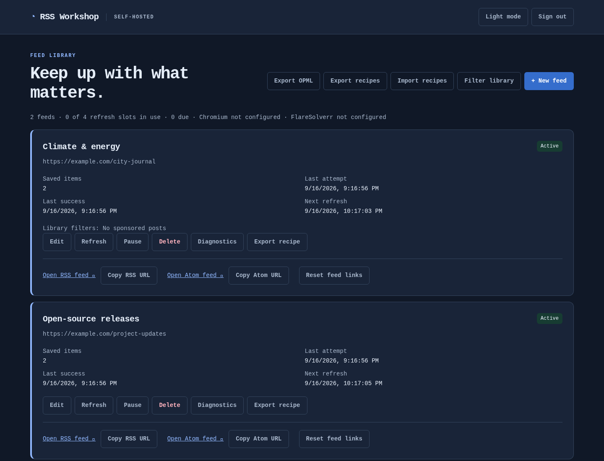
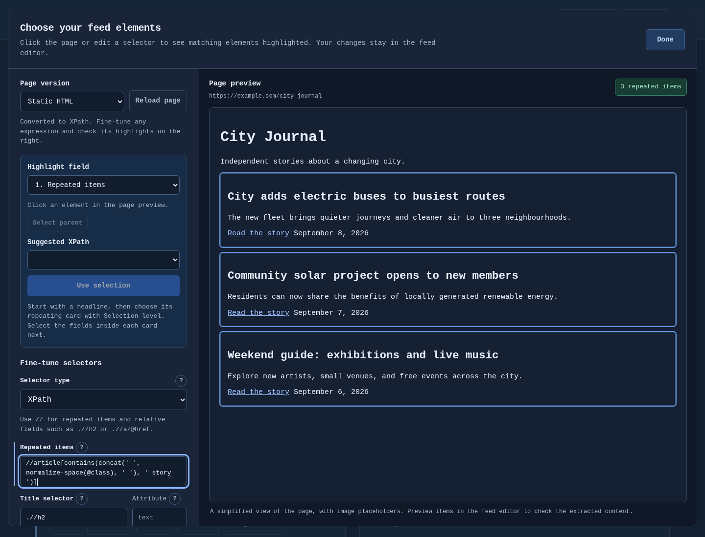
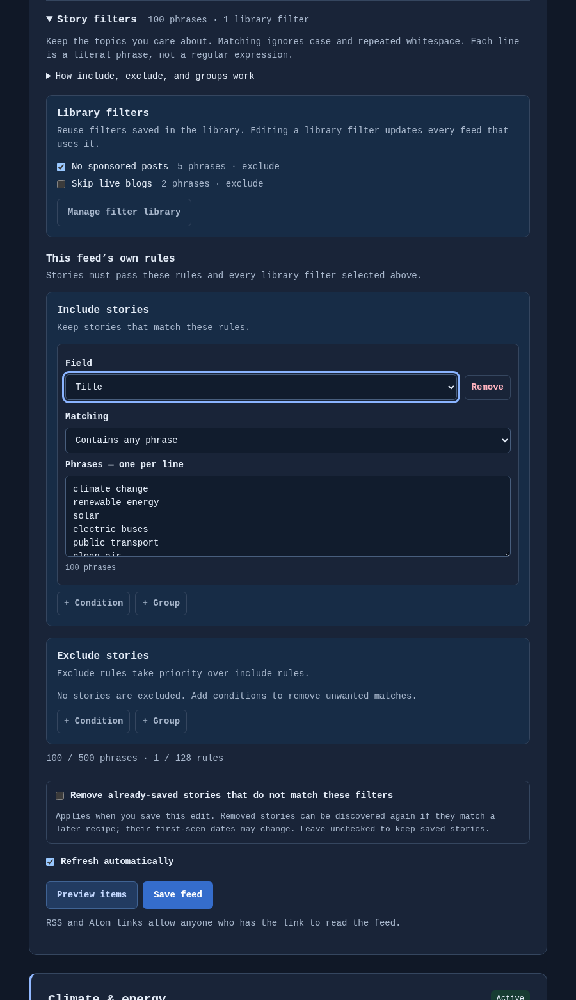
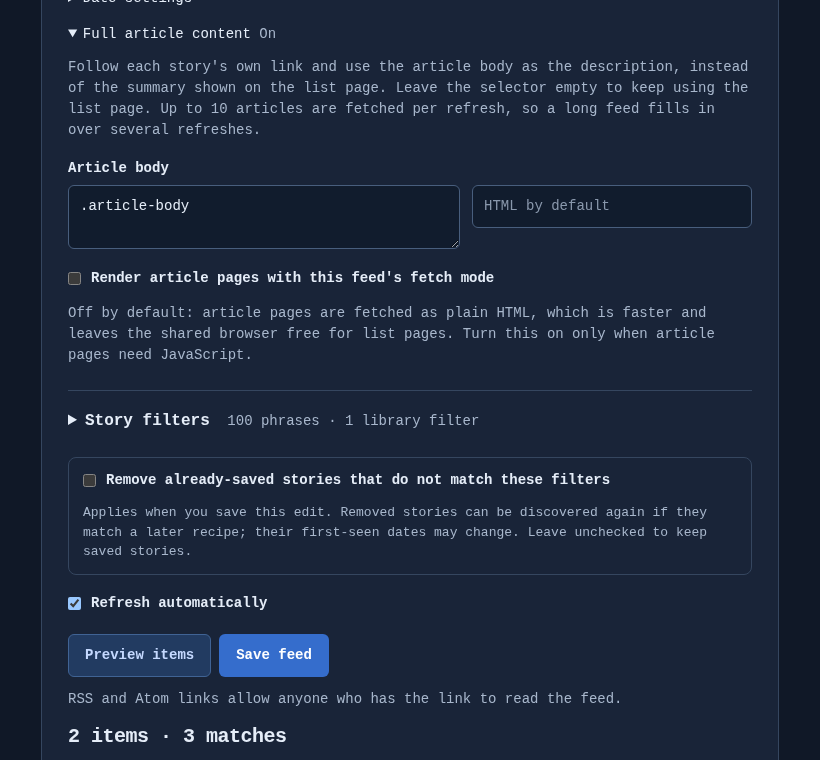
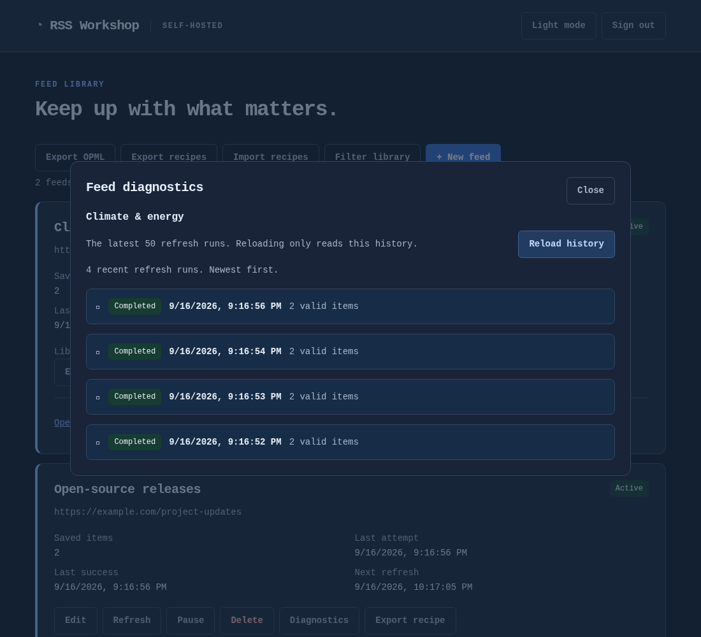

# RSS Workshop

RSS Workshop is a self-hosted RSS and Atom feed generator for websites that don’t provide feeds. Build feeds visually or with CSS/XPath selectors, render JavaScript sites with Chromium, filter stories, and publish persistent RSS/Atom URLs.

The default Docker installation includes Chromium for JavaScript pages, SQLite, a single-admin interface, and dark mode. Data stays in local folders on your host.

## Why RSS Workshop?

RSS Workshop is designed for people looking for a self-hosted alternative to hosted RSS generators and tools such as Feedless, RSS.app, FetchRSS, and similar website-to-RSS services.

- Fully self-hosted, MIT licensed, no account and no third-party service
- Visual selector editor, with CSS and XPath side by side and live match highlighting
- JavaScript rendering with sandboxed Chromium, or an optional external FlareSolverr
- Full article content: follow each story’s link and publish the article, not the teaser
- Story include/exclude filters with nested rules and bulk keyword lists
- RSS and Atom output with stable item identities, plus OPML export of every feed
- Per-feed diagnostics, Prometheus metrics, and verified backup and restore
- SQLite or PostgreSQL, Docker or a standalone Linux executable



## Quickstart

With Docker Engine and the Compose plugin installed:

```sh
git clone https://github.com/Ldogg123/rss-workshop.git
cd rss-workshop
cp .env.example .env
chmod 600 .env
```

Set `ADMIN_PASSWORD` in `.env` to a password of your choosing. There is no default, and the server refuses to start without one.

Create the data directory. RSS Workshop runs as an unprivileged user inside the container and will not create this for you, so that a typo cannot silently start a fresh database somewhere unexpected:

```sh
sudo mkdir -p -m 700 ./data
sudo chown 65532:65532 ./data
docker compose up -d --pull always --wait
```

Open [localhost:8080](http://localhost:8080) and sign in. Use `sudo docker` if your account requires it. SQLite data lives in `./data/rss.db`, and Compose pulls `ghcr.io/ldogg123/rss-workshop:latest`, the current stable image with Chromium.

## Your first feed

1. Choose **New feed** and enter a name and the page you want a feed from.
2. Choose **Choose elements visually**. Click a repeating card on the page, then its title, link, description, image and date. Edit the CSS or XPath beside the live preview to fine-tune what matches.
3. Optionally turn on **Full article content** to publish each story’s own article body instead of the list-page teaser, and add **Story filters** to keep or drop stories by keyword.
4. Choose **Preview items** to see exactly what a reader will receive, then save.
5. Copy the RSS or Atom URL into your reader.

Prefer to see it working before pointing it at a real site? The repository ships a small demo newspaper and three ready-made recipes covering every field, XPath, filtering and full article content. Serve it, import the recipes, and preview: see [examples](docs/examples/).

Reader requests serve saved stories and never fetch the source, so a slow or broken site cannot stall your reader, and a failed refresh keeps the last good output. Anyone holding a feed link can read it; **Reset feed links** revokes a feed’s existing URLs.

To subscribe to everything at once, choose **Export OPML** and import the file into your reader. It contains every feed link, so keep it private.

<details>
<summary>See the visual editor, story filters, and full article content</summary>

Choose elements visually and refine CSS or XPath beside the highlighted source page:



Combine include and exclude groups, and paste long keyword lists:



Follow each story’s link and publish the article body rather than the teaser:



Screenshots use sample feeds.

</details>

## When something breaks

Sites change their markup, and a feed that quietly stops updating is the usual symptom.

- **Preview items** explains why a story was rejected, field by field.
- A saved feed’s **Diagnostics** shows its last 50 refreshes with fetch mode, HTTP status, timing, match counts and field samples.
- `docker compose logs -f rss-workshop` reports each refresh and the reason for any failure; set `LOG_LEVEL` to `warn` for problems only.
- Setting `METRICS_TOKEN` exposes `/metrics` for Prometheus, including per-feed failure counts and last-success times, so an alert can name the feed that broke.



See [diagnostics and retention](docs/operations.md#feed-diagnostics) and [log detail](docs/operations.md#log-detail).

## Updates

After making a [verified backup](docs/operations.md#backup-and-restore), run the same command you installed with:

```sh
docker compose up -d --pull always --wait
```

Use the same Compose overrides as your installation. Every released database schema upgrades directly to the current one, in a single transaction, and an older release will refuse to open a newer database — so take the backup first. See [upgrade compatibility and rollback](docs/operations.md#upgrades).

## Other ways to run

| | |
| --- | --- |
| **Without Docker** | Download a Linux `amd64` or `arm64` executable from [Releases](https://github.com/Ldogg123/rss-workshop/releases). It includes the web UI and SQLite; Go and Docker are not needed. See [native installation](docs/deployment.md#run-a-prebuilt-executable). |
| **Behind a reverse proxy** | For HTTPS and remote access. A proxy running in Docker needs `compose.proxy.yaml`; see [reverse proxy](docs/reverse-proxy.md). |
| **Without Chromium** | `compose.static.yaml` selects a much smaller image for sites that need no JavaScript rendering. |
| **With PostgreSQL** | `compose.postgres.yaml` adds a database service. See [PostgreSQL setup](docs/postgresql.md); switching databases does not migrate existing data. |
| **Through a VPN** | `compose.gluetun.yaml` shares an existing Gluetun container’s network. See [VPN networking](docs/gluetun.md). |

Every option is an override applied after `compose.yaml`, for example `docker compose -f compose.yaml -f compose.static.yaml up -d --pull always --wait`. [Deployment](docs/deployment.md) has the full configuration reference and the order to combine them in.

## Documentation

- [Visual selectors](docs/visual-selector.md), [story filters](docs/filtering.md), [dates](docs/dates.md), and [RSS/Atom output](docs/atom.md)
- [Reverse proxy](docs/reverse-proxy.md), [browser rendering](docs/browser.md), [FlareSolverr](docs/flaresolverr.md), and [Gluetun VPN](docs/gluetun.md)
- [Recipe import/export](docs/recipe-portability.md) and [example recipes](docs/examples/) with a runnable demo site
- [Backups, restores, and upgrades](docs/operations.md), and [deployment and configuration](docs/deployment.md)
- [Development](CONTRIBUTING.md), [repository guide](AGENTS.md), [releases](docs/releases.md), and [changelog](CHANGELOG.md)

## Versioning

From 1.0 these are commitments for the 1.x line:

- **Every released database schema upgrades directly to the current one**, in a single transaction, with a rollback if any step fails. You never need to install an intermediate version.
- **There is no in-place downgrade.** An older release refuses to open a newer database rather than damaging it, so rolling back means restoring a backup taken before the upgrade. Take one before every upgrade.
- **Environment variable names do not change.** `STATIC_WORKERS` keeps its name for the life of 1.x even though it governs all refresh and preview slots, not only static ones.
- **Reader URLs stay stable and private.** Item identities and publication dates never change once a story is first seen, so subscribers never see duplicates or reordering across upgrades.
- **Reader requests never fetch the source**, and a failed or empty refresh keeps the last good output.
- **Single admin, one application process per database.** Nothing enforces the one-process rule, so it is yours to keep.

Security fixes are best-effort and apply to the latest release; see [SECURITY.md](SECURITY.md).

## License and security

RSS Workshop is [MIT licensed](LICENSE). Dependencies retain their own licenses; see [licensing and redistribution](docs/licensing.md) and [dependency notices](docs/dependencies.md). Report vulnerabilities using the process in [SECURITY.md](SECURITY.md).
